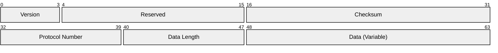

# Nodayama Data Transfer Protocol - Draft 2025-03

## 概要

Nodayama Data Transfer Protocol(以下、NDTP)は、
チェックサムによるデータの検証を行うことができる
通信プロトコルである。

## パケット

NDTPパケットは以下の形式に従う。
なお、数値表現はすべてビッグエンディアンで格納する。

「Version」はNDTPのバージョンである。

「Reserved」は将来のバージョンのために予約されている。常に0である。

「Checksum」はNDTPパケットのチェックサムである。
詳細は[チェックサム](#チェックサム)を参照。

「Protocol Number」は内包しているデータのプロトコルの番号である。
0番を除くプロトコル番号の一覧は[別紙](protocol-id.md)を参照。
プロトコル番号0については[プロトコル番号0](#プロトコル番号0)を参照。

「Data Length」は内包しているデータのサイズである。単位はバイトである。

「Data」は内包するデータを格納する。
「Data Length」で指定された長さでなければならない。

## チェックサム

チェックサムは以下の手順に従って計算される。

1. NDTPヘッダのチェックサム欄にゼロをセット
2. NTDPヘッダを16ビット単位で加算
3. 総和の下位16ビットの1の補数を取る

## プロトコル番号0

プロトコル番号0は「生データ」を表す特別な内包プロトコルである。
内包プロトコルを必要とせず、直接データを転送する場合に使用する。
