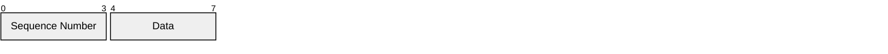

# Nodayama Low-layer Transfer Protocol - Draft 2025-03

## 概要

Nodayama Low-layer Transfer Protocol(以下、NLTP)は、
シーケンス番号による到達保証を行うことができる
通信プロトコルである。

## パケット

NLTPパケットは以下の形式に従い、必ず8バイト分送信される。

「Sequence Number」は4ビットの通し番号である。
通信開始時に0をセットし、順次インクリメントする。

「Data」は転送するデータである。4ビットごとに分割する。
データが8バイトに満たない場合、パディングとして末尾に0を付加する。
